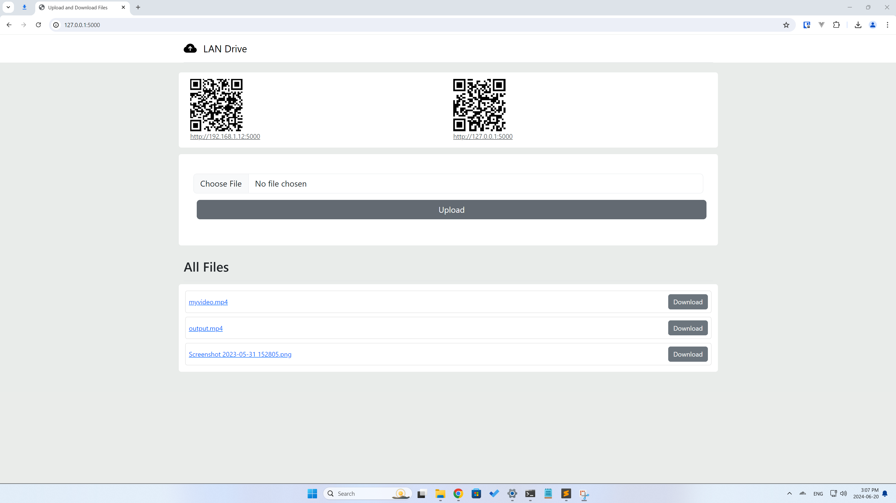

# LAN DRIVE v0.0.1

A beginner-friendly file-sharing application for devices on the same network (WiFi or wired).

## Two Methods To Run This App

### 1. Download LanDrive.exe from the Release Page

Perfect for those without programming knowledge. Simply download the binary file and double-click to run.

For Mac OS users, you can build the binary yourself with the following commands (Python required):

`pip install -r requirements.txt`

`pyinstaller --name=LanDrive --onefile LanDrive.py`

The binary file will be output to the `dist/` folder.

### 2. Run from Source Code

If you have Python installed on your computer, you can run the app from the source code with:

`python LanDrive.py`